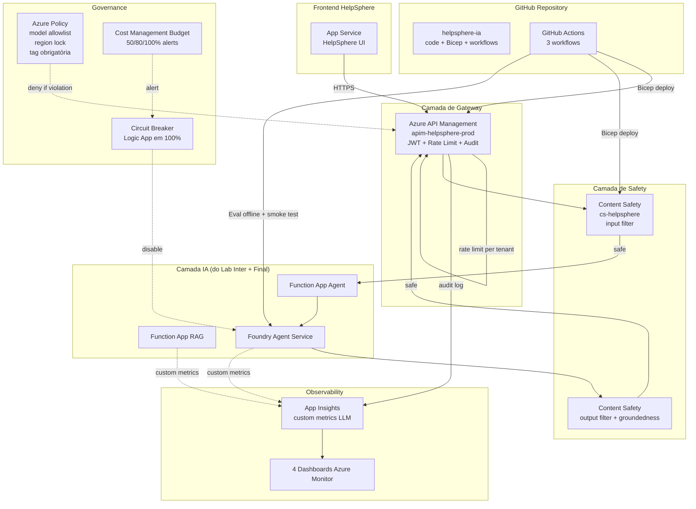

# Lab Avançado — IA em Produção: CI/CD, Content Safety, APIM, Governance, FinOps
## Guia Passo-a-Passo no Azure Portal

---

> **Slides cobertos:** #39-#41 (Bloco 6 — IA em Produção)
>
> **Disciplina 06** · **Lab 3 de 3** · **Duração estimada:** 8 horas · **Modalidade:** gravada · **Version-anchor:** Q2-2026
>
> **Cenário:** tudo que foi construído nos Labs 1 e 2 vai pro ar atendendo SLOs do contrato Apex (99.5% disponibilidade, p95 < 3s, content safety obrigatório, custo cap R$ 0.30/ticket). Pipeline CI/CD completo via GitHub Actions, infra-as-code Bicep parametrizado, governance via Azure Policy, observabilidade customizada para LLM, e cost cap proativo.
>
> **Pré-requisitos — você pode chegar aqui de 2 formas:**
> - **(a) Sequencial:** vem direto de Lab Inter + Lab Final, mantém `rg-helpsphere-ia` rodando, reusa estado existente (recomendado se gravando os 3 labs em sequência).
> - **(b) Standalone:** clone fresh de `apex-helpsphere` e rode `azd up` (~15min) para provisionar a fundação SaaS, depois Lab Avançado provisiona a camada de governance/CI-CD por cima. Útil se está revisitando só este lab.

---

> ## ⚠️ CUSTO E FREE TRIAL
> | Item | Valor |
> |------|-------|
> | Custo mensal (recursos deixados rodando) | ~R$ 600/mês (APIM Developer pesa) |
> | **Custo realista do lab (provisionar e deletar no mesmo dia)** | **R$ 35-45 saindo do bolso** |
> | Compatível com Free Trial USD 200? | **NÃO** |
> | Cuidado especial | APIM Developer = ~R$ 250/mês se ficar ligado · Provisionamento APIM leva 30-45 min |
>
> **Avisos do dia:**
> 1. **APIM provisionamento é lento** (~30-45min). Provisione no início e siga outras partes em paralelo.
> 2. **Content Safety free tier** existe (5K transações/mês) — para o lab ficamos no free tier.
> 3. **GitHub Actions é gratuito** para repos públicos ou primeiros 2.000 minutos/mês em private — não há custo Azure aqui.

---

### 🔗 Repositório companion (estado finalizado do Lab Avançado)

> **GitHub:** [`apex-helpsphere-prod-lab`](https://github.com/tftec-guilherme/apex-helpsphere-prod-lab) — repo público com Bicep modules production-ready (APIM + Content Safety + App Insights + Azure Policy) + 3 GitHub Actions workflows (CI/CD staging/CD prod) + Function code Python + eval/ scripts. Use para:
>
> - **Fork-and-adapt** os pipelines CI/CD pra sua subscription Azure
> - **Consulta** durante o lab dos Bicep modules e workflows YAML
> - **Referência** do estado final esperado
>
> ⚠️ Este repo é um **scaffold inicial** (`v0.1.0-init`) — código completo será preenchido durante a gravação dos Blocos do Lab Avançado.

---

## Pré-requisitos

- ✅ Labs Intermediário e Final concluídos (entendimento de RAG + Agente + MCP)
- ✅ `rg-helpsphere-ia` ainda existindo
- ✅ Conta GitHub com repositório vazio criado: `helpsphere-ia` (private OK)
- ✅ Azure CLI logado, Bicep CLI instalado
- ✅ GitHub CLI (`gh`) instalado e autenticado
- ✅ VS Code com extensão Bicep e GitHub Actions

### Premissa importante

Como os Labs 1 e 2 deletaram seus RGs ao final, vamos **re-provisionar** uma versão simplificada via Bicep neste Lab Avançado. O foco aqui não é "rebuild RAG e Agente do zero" — é "infra-as-code + governance + production checklist". A camada de aplicação é tratada como **artefatos pré-prontos**, deployed via pipeline.

---

## Tabela de recursos que serão criados

| Recurso | Nome canônico | SKU/Tier | Custo mensal | Custo no lab |
|---|---|---|---|---|
| Resource Group | `rg-lab-avancado` | N/A | Gratuito | — |
| API Management | `apim-helpsphere-prod` | **Developer** (não use Standard) | R$ 250/mês | R$ 12-15 |
| Content Safety | `cs-helpsphere` | F0 (Free) ou S0 | F0 grátis | R$ 0 (free) |
| Application Insights (re-uso) | `appi-helpsphere-ia` (linkado a `log-helpsphere-ia`) | Workspace-based | já criado | — |
| Azure Policy assignments | various | gratuito | — | — |
| GitHub Actions Service Principal | `sp-github-actions-helpsphere` | — | gratuito | — |
| Cost Management Budget | `budget-helpsphere-ia` | gratuito | — | — |
| Action Group (alerts) | `ag-helpsphere-ia-alerts` | gratuito | — | — |
| **Total** | | | **~R$ 600/mês ligado** | **R$ 35-45 lab realista** |

> **Observação:** este lab consome também Azure OpenAI tokens nos testes de eval. Esses ~R$ 5-10 saem do quota separado (`rg-helpsphere-ia` ou `aifproj-helpsphere-rag`).

---

## Diagrama da arquitetura production



---

## Estrutura do lab — 7 partes ao longo de 8 horas

| Parte | Duração | Atividade |
|---|---|---|
| Parte 1 | 30min | Setup repositório GitHub + Service Principal Azure |
| Parte 2 | 2h | Bicep templates parametrizados (3 envs) |
| Parte 3 | 2h | GitHub Actions: CI + CD staging + CD prod com manual approve |
| Parte 4 | 1h | API Management como gateway (provisão + políticas) |
| Parte 5 | 1h | Content Safety integration + Application Insights custom metrics |
| Parte 6 | 1h | Azure Policy + Cost Management + circuit breaker |
| Parte 7 | 30min | Eval offline integrado + RUNBOOK.md + cleanup |

---

# Parte 1 — Setup repositório GitHub + Service Principal (30min)

## Passo 1.1 — Criar RG do lab

**No Portal Azure:**

1. Barra superior → buscar **"Resource groups"** → clicar
2. **+ Create**
3. Preencher tab **Basics**:
   - **Subscription:** sua
   - **Resource group:** `rg-lab-avancado`
   - **Region:** `East US 2`
4. Tab **Tags** (recomendado para FinOps neste lab production-grade):
   - `cost-center` = `apex-helpsphere-ia`
   - `environment` = `lab`
   - `application` = `helpsphere-ia`
   - `owner` = `<seu-email>`
5. **Review + create** → **Create**
6. Aguardar ~5s até notificação "Resource group successfully created"

<!-- screenshot: passo-1.1-criar-rg-lab-avancado.png -->

> **Alternativa via Azure CLI (Linux/Mac/WSL — bash):**
>
> ```bash
> az group create \
>   --name rg-lab-avancado \
>   --location eastus2 \
>   --tags cost-center=apex-helpsphere-ia environment=lab application=helpsphere-ia
> ```

> **Por que tags importam aqui?** Parte 6 deste lab cria uma Azure Policy `helpsphere-cost-center-tag-required` que **bloqueia recursos sem tag `cost-center`**. Se você criar o RG sem tag, terá que adicionar depois OU desabilitar a policy temporariamente — comece certo.

## Passo 1.2 — Criar repositório GitHub `helpsphere-ia`

Este lab é IaC end-to-end — o código (Bicep + workflows + Python) vive num repo GitHub que dispara GitHub Actions ao push.

**No GitHub (https://github.com):**

1. Logado no GitHub → canto superior direito → **+** → **New repository**
2. Preencher:
   - **Owner:** seu user
   - **Repository name:** `helpsphere-ia`
   - **Description:** `Lab Avançado D06 — IA Production-grade (Apex HelpSphere)`
   - **Visibility:** **Private** (recomendado — secrets de Azure visíveis só pra você)
   - **Initialize this repository with:** marque ☑ **Add a README file**
   - **Add .gitignore:** selecione **Python**
   - **Choose a license:** None (lab interno)
3. **Create repository**
4. Após criação, clone para sua máquina local:
   ```bash
   git clone https://github.com/<seu-username>/helpsphere-ia.git
   cd helpsphere-ia
   ```

<!-- screenshot: passo-1.2-github-create-repo.png -->

5. Crie a estrutura inicial de pastas localmente:

```powershell
# Criar estrutura de pastas
New-Item -ItemType Directory -Force -Path .github/workflows, infra/modules, infra/envs, src/agent, src/mcp-server, src/functions, eval, docs

# README customizado (substitui o default do GitHub)
@'
# HelpSphere IA — Production Stack

Stack production-ready de IA para HelpSphere Apex.

## Estrutura
- `.github/workflows/` — CI + CD staging + CD prod
- `infra/` — Bicep templates parametrizados
- `src/` — código (agent, MCP server, functions)
- `eval/` — dataset e script de eval offline
- `docs/RUNBOOK.md` — operação em produção
'@ | Set-Content -Path README.md -Encoding UTF8

# Append ao .gitignore default Python (que o GitHub criou)
@'

# Lab Avançado D06 specifics
.azure/
sp-credentials.json
*.log
node_modules/
'@ | Add-Content -Path .gitignore -Encoding UTF8

git add .
git commit -m "feat: initial scaffold helpsphere-ia"
git push origin main
```

> **Alternativa via gh CLI (criar repo direto da máquina) — PowerShell:**
>
> ```powershell
> New-Item -ItemType Directory -Force -Path helpsphere-ia; Set-Location helpsphere-ia
> git init -b main
> # ... criar arquivos ...
> gh repo create helpsphere-ia --private --source=. --remote=origin --push
> ```
>
> Funciona se você já tem `gh` autenticado (`gh auth status`).
>
> **Linux/Mac/WSL:** troque `New-Item ... ; Set-Location` por `mkdir helpsphere-ia && cd helpsphere-ia`.

## Passo 1.3 — Criar Service Principal para GitHub Actions

GitHub Actions precisa de identidade Azure para deployar via Bicep. Criamos um **App Registration** + **Service Principal** com escopo limitado ao `rg-lab-avancado`.

**No Portal Azure (Microsoft Entra ID — App Registration):**

1. Barra superior → buscar **"Microsoft Entra ID"** → clicar
2. Menu lateral → **App registrations** → **+ New registration**
3. Preencher:
   - **Name:** `sp-github-actions-helpsphere`
   - **Supported account types:** `Accounts in this organizational directory only (Single tenant)`
   - **Redirect URI:** deixar vazio (não é app web)
4. **Register**
5. Após criação, anote da página **Overview**:
   - **Application (client) ID** — será `AZURE_CLIENT_ID` no GitHub Secrets
   - **Directory (tenant) ID** — será `AZURE_TENANT_ID`

<!-- screenshot: passo-1.3-app-registration-helpsphere.png -->

**No Portal Azure (atribuir role Contributor no RG):**

6. Buscar **"Resource groups"** → clicar em `rg-lab-avancado`
7. Menu lateral → **Access control (IAM)** → **+ Add** → **Add role assignment**
8. Tab **Role:** procurar **`Contributor`** → selecionar → **Next**
9. Tab **Members:**
   - **Assign access to:** `User, group, or service principal`
   - **+ Select members** → digitar `sp-github-actions-helpsphere` → selecionar
10. **Review + assign** → **Review + assign**

<!-- screenshot: passo-1.3-rbac-contributor-rg.png -->

> **Alternativa via Azure CLI (Linux/Mac/WSL — bash, mais rápido — cria App Reg + SP + role assignment numa só chamada):**
>
> ```bash
> SUBSCRIPTION_ID=$(az account show --query id -o tsv)
>
> SP_JSON=$(az ad sp create-for-rbac \
>   --name "sp-github-actions-helpsphere" \
>   --role Contributor \
>   --scopes "/subscriptions/${SUBSCRIPTION_ID}/resourceGroups/rg-lab-avancado" \
>   --json-auth)
>
> echo "$SP_JSON" > sp-credentials.json
> # Anote os IDs:
> echo "$SP_JSON" | jq -r '.clientId, .tenantId, .subscriptionId'
> ```
>
> **Não comite `sp-credentials.json`** — já está no .gitignore.

## Passo 1.4 — Configurar Federated Credentials (OIDC sem secret)

Em vez de armazenar client secret no GitHub, usamos **OIDC federation trust** entre GitHub Actions e Entra ID — GitHub apresenta um token JWT, Entra valida, ninguém troca segredo. **Production-grade.**

**No Portal Azure (Entra ID → App registration → Federated credentials):**

1. **Microsoft Entra ID** → **App registrations** → `sp-github-actions-helpsphere`
2. Menu lateral → **Manage** → **Certificates & secrets**
3. Tab **Federated credentials** → **+ Add credential**
4. **Federated credential scenario:** `GitHub Actions deploying Azure resources`
5. Preencher (credential 1 — main branch):
   - **Organization:** seu username GitHub (`<seu-username>`)
   - **Repository:** `helpsphere-ia`
   - **Entity type:** `Branch`
   - **GitHub branch name:** `main`
   - **Name:** `github-helpsphere-main`
   - **Description:** `Deploy from main branch`
6. **Add**

<!-- screenshot: passo-1.4-federated-credential-main.png -->

7. Repita o fluxo para **credential 2 — Pull Requests** (necessário pra what-if no CI):
   - **Entity type:** `Pull request`
   - **Name:** `github-helpsphere-pr`
   - **Description:** `Validate from PRs`
8. **Add**

> **Alternativa via Azure CLI (Linux/Mac/WSL — bash):**
>
> ```bash
> APP_ID=$(az ad app list --display-name "sp-github-actions-helpsphere" --query "[0].appId" -o tsv)
>
> # Credential 1 — main branch
> cat > fc-main.json <<EOF
> {
>   "name": "github-helpsphere-main",
>   "issuer": "https://token.actions.githubusercontent.com",
>   "subject": "repo:<seu-username>/helpsphere-ia:ref:refs/heads/main",
>   "audiences": ["api://AzureADTokenExchange"]
> }
> EOF
> az ad app federated-credential create --id $APP_ID --parameters fc-main.json
>
> # Credential 2 — PRs
> cat > fc-pr.json <<EOF
> {
>   "name": "github-helpsphere-pr",
>   "issuer": "https://token.actions.githubusercontent.com",
>   "subject": "repo:<seu-username>/helpsphere-ia:pull_request",
>   "audiences": ["api://AzureADTokenExchange"]
> }
> EOF
> az ad app federated-credential create --id $APP_ID --parameters fc-pr.json
> ```

## Passo 1.5 — Adicionar GitHub Secrets

Os 3 IDs (Tenant, Subscription, Client) precisam virar **secrets** do repo `helpsphere-ia` para os workflows usarem em `azure/login@v2`.

**No GitHub (Repository → Settings → Secrets):**

1. Acesse `https://github.com/<seu-username>/helpsphere-ia/settings/secrets/actions`
2. **+ New repository secret** — adicione 3 secrets em sequência:
   - **Name:** `AZURE_TENANT_ID` · **Secret:** valor do Tenant ID anotado no Passo 1.3 → **Add secret**
   - **Name:** `AZURE_SUBSCRIPTION_ID` · **Secret:** rode `az account show --query id -o tsv` localmente → **Add secret**
   - **Name:** `AZURE_CLIENT_ID` · **Secret:** valor do Application (client) ID anotado no Passo 1.3 → **Add secret**
3. Adicione também o secret necessário pro eval offline:
   - **Name:** `AOAI_API_KEY` · **Secret:** key do Azure OpenAI (recurso `aifproj-helpsphere-rag` do Lab Inter, ou crie um novo se rodando standalone) → **Add secret**

<!-- screenshot: passo-1.5-github-secrets.png -->

> **Alternativa via gh CLI (Linux/Mac/WSL — bash):**
>
> ```bash
> TENANT_ID=$(az account show --query tenantId -o tsv)
> SUBSCRIPTION_ID=$(az account show --query id -o tsv)
> CLIENT_ID=$(az ad sp list --display-name "sp-github-actions-helpsphere" --query "[0].appId" -o tsv)
>
> gh secret set AZURE_TENANT_ID --body "$TENANT_ID"
> gh secret set AZURE_SUBSCRIPTION_ID --body "$SUBSCRIPTION_ID"
> gh secret set AZURE_CLIENT_ID --body "$CLIENT_ID"
> gh secret set AOAI_API_KEY --body "<sua-key-aoai>"
> ```

## ✅ Checkpoint Parte 1

- [ ] RG `rg-lab-avancado` criado
- [ ] Repo GitHub `helpsphere-ia` existe e tem scaffold inicial
- [ ] Service Principal `sp-github-actions-helpsphere` com Contributor no RG
- [ ] Federated credentials configuradas (main branch + PR)
- [ ] GitHub Secrets registrados

---

# Parte 2 — Bicep templates parametrizados (2h)

> **Nota Portal sobre Parte 2:** esta Parte cria os arquivos Bicep que representam a infraestrutura — um modelo declarativo. **Por design**, IaC complexo (multi-env + governance + role grants subscription-scoped) é tratado em código, não no Portal. O Portal Azure é usado para **visualizar** o resultado pós-deploy (Parte 3).
>
> Os arquivos Bicep abaixo são **canonical para o lab** — você cria localmente em VS Code (com extensão Bicep para validation/IntelliSense), commita, e deixa o GitHub Actions deployar (Parte 3). Em produção real, esse é o pattern: Bicep no repo, pipeline aplica, Portal só pra inspeção/troubleshooting.
>
> Após `git push` + CD Staging executar (Parte 3), você pode visualizar todos os recursos no Portal Azure → **Resource groups** → `rg-lab-avancado` → veja APIM, Content Safety, App Insights provisionados.

## Passo 2.1 — `infra/main.bicep` (entry point)

```bicep
// infra/main.bicep
@description('Environment name')
param env string

@description('Azure region')
param location string = 'eastus2'

@description('Tags applied to all resources')
param tags object = {
  'cost-center': 'apex-helpsphere-ia'
  environment: env
  application: 'helpsphere-ia'
}

@description('APIM SKU - Developer for non-prod, Standard for prod')
param apimSku string = (env == 'prod') ? 'Standard' : 'Developer'

@description('Content Safety SKU')
@allowed(['F0', 'S0'])
param contentSafetySku string = 'F0'

@description('Subscription ID for cross-RG references')
param subscriptionId string = subscription().subscriptionId

// Modules
module apim 'modules/apim.bicep' = {
  name: 'apim-deployment'
  params: {
    location: location
    name: 'apim-helpsphere-${env}'
    sku: apimSku
    tags: tags
  }
}

module contentSafety 'modules/content-safety.bicep' = {
  name: 'content-safety-deployment'
  params: {
    location: location
    name: 'cs-helpsphere-${env}'
    sku: contentSafetySku
    tags: tags
  }
}

module appInsights 'modules/app-insights.bicep' = {
  name: 'app-insights-deployment'
  params: {
    location: location
    name: 'ai-helpsphere-${env}'
    workspaceId: '/subscriptions/${subscriptionId}/resourceGroups/rg-helpsphere-ia/providers/Microsoft.OperationalInsights/workspaces/log-helpsphere-ia'
    tags: tags
  }
}

// NOTE: o módulo policy.bicep tem targetScope='subscription' (definitions + role grants
// no escopo da subscription). Por isso NÃO é instanciado aqui (este main.bicep tem
// scope=resourceGroup). Deploy separado:
//   az deployment sub create --location <region> --template-file infra/modules/policy.bicep ...
// Veja Passo 2.5 / Passo 6.1 para o comando completo.

output apimGatewayUrl string = apim.outputs.gatewayUrl
output contentSafetyEndpoint string = contentSafety.outputs.endpoint
output appInsightsConnectionString string = appInsights.outputs.connectionString
```

## Passo 2.2 — `infra/modules/apim.bicep`

> **TECH-AVA-006 fix:** o `logger` referencia o named value `instrumentation-key`. Em Bicep, a ordem dos `resource` no template não garante ordem de criação no Azure — declaramos `dependsOn` explícito para forçar `namedValue` ANTES do `logger`. Sem isso, o deploy falha com `ResourceNotFound: instrumentation-key` na primeira execução.
>
> Adicionamos também o parâmetro `appInsightsInstrumentationKey` (passado pelo `main.bicep` via output do módulo App Insights) e marcamos o named value como `secret: true` para o instrumentation key não vazar em logs/templates exportados.

```bicep
// infra/modules/apim.bicep
param location string
param name string
param sku string
param tags object

@description('Instrumentation key do Application Insights — vem do output appInsights.instrumentationKey no main.bicep')
@secure()
param appInsightsInstrumentationKey string

resource apim 'Microsoft.ApiManagement/service@2023-09-01-preview' = {
  name: name
  location: location
  tags: tags
  sku: {
    name: sku
    capacity: 1
  }
  properties: {
    publisherName: 'Apex Group'
    publisherEmail: 'platform@apex.com.br'
    virtualNetworkType: 'None'
  }
  identity: {
    type: 'SystemAssigned'
  }
}

// 1) Named value criado PRIMEIRO (logger depende dele)
//    secret: true para o instrumentation key não vazar em template exports / portal UI
resource namedValueInstrumentationKey 'Microsoft.ApiManagement/service/namedValues@2023-09-01-preview' = {
  parent: apim
  name: 'instrumentation-key'
  properties: {
    displayName: 'instrumentation-key'
    value: appInsightsInstrumentationKey
    secret: true
  }
}

// 2) Logger criado APÓS named value (dependsOn explícito)
resource logger 'Microsoft.ApiManagement/service/loggers@2023-09-01-preview' = {
  parent: apim
  name: 'app-insights-logger'
  properties: {
    loggerType: 'applicationInsights'
    description: 'App Insights logger for audit'
    credentials: {
      instrumentationKey: '{{instrumentation-key}}'  // referência ao named value criado acima
    }
  }
  dependsOn: [
    namedValueInstrumentationKey
  ]
}

// 3) Diagnostic settings — usa o logger
resource diagnostic 'Microsoft.ApiManagement/service/diagnostics@2023-09-01-preview' = {
  parent: apim
  name: 'applicationinsights'
  properties: {
    alwaysLog: 'allErrors'
    logClientIp: true
    loggerId: logger.id
    sampling: {
      samplingType: 'fixed'
      percentage: 100
    }
    verbosity: 'information'
  }
}

output gatewayUrl string = apim.properties.gatewayUrl
output principalId string = apim.identity.principalId
```

> **Lembrete:** atualize `main.bicep` para passar o instrumentation key ao módulo APIM:
>
> ```bicep
> module apim 'modules/apim.bicep' = {
>   name: 'apim-deployment'
>   params: {
>     location: location
>     name: 'apim-helpsphere-${env}'
>     sku: apimSku
>     tags: tags
>     appInsightsInstrumentationKey: appInsights.outputs.instrumentationKey
>   }
> }
> ```

## Passo 2.3 — `infra/modules/content-safety.bicep`

```bicep
// infra/modules/content-safety.bicep
param location string
param name string
param sku string
param tags object

resource contentSafety 'Microsoft.CognitiveServices/accounts@2024-04-01-preview' = {
  name: name
  location: location
  tags: tags
  kind: 'ContentSafety'
  sku: {
    name: sku
  }
  properties: {
    customSubDomainName: name
    publicNetworkAccess: 'Enabled'
  }
}

output endpoint string = contentSafety.properties.endpoint
output id string = contentSafety.id
```

## Passo 2.4 — `infra/modules/app-insights.bicep`

```bicep
// infra/modules/app-insights.bicep
param location string
param name string
param workspaceId string
param tags object

resource appInsights 'Microsoft.Insights/components@2020-02-02' = {
  name: name
  location: location
  tags: tags
  kind: 'web'
  properties: {
    Application_Type: 'web'
    WorkspaceResourceId: workspaceId
  }
}

output connectionString string = appInsights.properties.ConnectionString
output instrumentationKey string = appInsights.properties.InstrumentationKey
```

## Passo 2.5 — `infra/modules/policy.bicep`

> **D12 fix — bug recorrente:** `Microsoft.Authorization/policyDefinitions` e `policyAssignments` em **scope = subscription** não podem ser declarados num módulo cujo deployment alvo é `resourceGroup`. Isso faz Bicep falhar com `InvalidTemplate: scope mismatch`. A correção é **`targetScope = 'subscription'`** no topo do arquivo + chamar este módulo via `az deployment sub create` (não `az deployment group create`).
>
> **Bug 2:** o SP `sp-github-actions-helpsphere` foi criado com role `Contributor` no RG (Passo 1.3). Mas Policy Assignment **cria role assignments compensatórios** (para o managed identity da policy ler/auditar recursos), e isso exige `Microsoft.Authorization/roleAssignments/write` — que `Contributor` NÃO tem. A correção é dar **`User Access Administrator`** (UAA) ao SP no escopo da subscription antes do Policy Assignment rodar.

```bicep
// infra/modules/policy.bicep — somente em prod
// Deploy via: az deployment sub create --location <region> --template-file infra/modules/policy.bicep
targetScope = 'subscription'

@description('Object ID do SP sp-github-actions-helpsphere — `az ad sp show --id <appId> --query id -o tsv`')
param githubActionsSpObjectId string

@description('RG onde os Policy Assignments aplicam')
param targetRgName string = 'rg-lab-avancado'

// =========================================================================
// STEP 1 — Role grants ao SP do GitHub Actions ANTES de Policy Assignment
// =========================================================================
// Policy Assignment exige 'Microsoft.Authorization/roleAssignments/write' para
// criar role assignments compensatórios (ex.: managed identity da policy lendo
// recursos). Contributor NÃO tem essa permissão. UAA tem.
// Damos os 2 roles ao SP no escopo da subscription:
//   - Contributor: criar/editar policy definitions e assignments
//   - User Access Administrator: criar role assignments compensatórios

// Built-in role IDs (constantes Azure — não mudam)
var contributorRoleId = 'b24988ac-6180-42a0-ab88-20f7382dd24c'
var userAccessAdminRoleId = '18d7d88d-d35e-4fb5-a5c3-7773c20a72d9'

resource contributorAssign 'Microsoft.Authorization/roleAssignments@2022-04-01' = {
  name: guid(subscription().id, githubActionsSpObjectId, contributorRoleId)
  scope: subscription()
  properties: {
    roleDefinitionId: subscriptionResourceId('Microsoft.Authorization/roleDefinitions', contributorRoleId)
    principalId: githubActionsSpObjectId
    principalType: 'ServicePrincipal'
  }
}

resource uaaAssign 'Microsoft.Authorization/roleAssignments@2022-04-01' = {
  name: guid(subscription().id, githubActionsSpObjectId, userAccessAdminRoleId)
  scope: subscription()
  properties: {
    roleDefinitionId: subscriptionResourceId('Microsoft.Authorization/roleDefinitions', userAccessAdminRoleId)
    principalId: githubActionsSpObjectId
    principalType: 'ServicePrincipal'
  }
}

// =========================================================================
// STEP 2 — Policy Definitions (criadas na subscription)
// =========================================================================
resource modelAllowlistDef 'Microsoft.Authorization/policyDefinitions@2023-04-01' = {
  name: 'helpsphere-model-allowlist'
  properties: {
    displayName: 'Allow only approved OpenAI models'
    policyType: 'Custom'
    mode: 'All'
    parameters: {
      allowedModels: {
        type: 'Array'
        defaultValue: ['gpt-4.1', 'gpt-4.1-mini', 'text-embedding-3-large']
      }
    }
    policyRule: {
      if: {
        allOf: [
          { field: 'type', equals: 'Microsoft.CognitiveServices/accounts/deployments' }
          { not: { field: 'Microsoft.CognitiveServices/accounts/deployments/model.name', in: '[parameters(\'allowedModels\')]' } }
        ]
      }
      then: { effect: 'deny' }
    }
  }
}

resource regionLockDef 'Microsoft.Authorization/policyDefinitions@2023-04-01' = {
  name: 'helpsphere-region-lock'
  properties: {
    displayName: 'Allow only approved regions for AI'
    policyType: 'Custom'
    mode: 'All'
    parameters: {
      allowedRegions: {
        type: 'Array'
        defaultValue: ['eastus2', 'swedencentral', 'switzerlandnorth']
      }
    }
    policyRule: {
      if: {
        allOf: [
          { field: 'type', equals: 'Microsoft.CognitiveServices/accounts' }
          { field: 'kind', equals: 'OpenAI' }
          { not: { field: 'location', in: '[parameters(\'allowedRegions\')]' } }
        ]
      }
      then: { effect: 'deny' }
    }
  }
}

resource tagRequiredDef 'Microsoft.Authorization/policyDefinitions@2023-04-01' = {
  name: 'helpsphere-cost-center-tag-required'
  properties: {
    displayName: 'Require cost-center tag on AI resources'
    policyType: 'Custom'
    mode: 'Indexed'
    policyRule: {
      if: {
        allOf: [
          { field: 'type', in: ['Microsoft.CognitiveServices/accounts', 'Microsoft.Search/searchServices'] }
          { field: 'tags[\'cost-center\']', exists: 'false' }
        ]
      }
      then: { effect: 'deny' }
    }
  }
}

// =========================================================================
// STEP 3 — Policy Assignments no escopo do RG (depois das role grants)
// =========================================================================
// dependsOn explícito força ordem: role grants COMPLETAM antes de assignments rodarem
var rgScope = '/subscriptions/${subscription().subscriptionId}/resourceGroups/${targetRgName}'

resource modelAllowlistAssign 'Microsoft.Authorization/policyAssignments@2023-04-01' = {
  name: 'helpsphere-model-allowlist'
  scope: tenantResourceId('Microsoft.Resources/resourceGroups', targetRgName)
  properties: {
    policyDefinitionId: modelAllowlistDef.id
    enforcementMode: 'Default'
  }
  dependsOn: [
    contributorAssign
    uaaAssign
  ]
}

resource regionLockAssign 'Microsoft.Authorization/policyAssignments@2023-04-01' = {
  name: 'helpsphere-region-lock'
  scope: tenantResourceId('Microsoft.Resources/resourceGroups', targetRgName)
  properties: {
    policyDefinitionId: regionLockDef.id
    enforcementMode: 'Default'
  }
  dependsOn: [
    contributorAssign
    uaaAssign
  ]
}

resource tagRequiredAssign 'Microsoft.Authorization/policyAssignments@2023-04-01' = {
  name: 'helpsphere-cost-center-tag-required'
  scope: tenantResourceId('Microsoft.Resources/resourceGroups', targetRgName)
  properties: {
    policyDefinitionId: tagRequiredDef.id
    enforcementMode: 'Default'
  }
  dependsOn: [
    contributorAssign
    uaaAssign
  ]
}

output rgScope string = rgScope
```

> **⚠️ Nota ABAC (conta `live.com` Visual Studio Enterprise):** se sua subscription pessoal tem condition ABAC ativada por default (caso comum em VSE pessoal), a tentativa de assignar `User Access Administrator` ao SP **vai falhar silenciosamente** ou retornar `RoleAssignmentExistsButNotEffective`. Nesse caso, **substitua UAA por `Owner` no escopo APENAS do `rg-lab-avancado`** (mais restrito que UAA na subscription inteira):
>
> ```bicep
> // Alternativa para subscriptions com ABAC: Owner no RG do lab apenas
> // (mais restrito do ponto de vista de blast radius)
> var ownerRoleId = '8e3af657-a8ff-443c-a75c-2fe8c4bcb635'
>
> resource ownerOnLabRg 'Microsoft.Authorization/roleAssignments@2022-04-01' = {
>   name: guid(targetRgName, githubActionsSpObjectId, ownerRoleId)
>   scope: tenantResourceId('Microsoft.Resources/resourceGroups', targetRgName)
>   properties: {
>     roleDefinitionId: subscriptionResourceId('Microsoft.Authorization/roleDefinitions', ownerRoleId)
>     principalId: githubActionsSpObjectId
>     principalType: 'ServicePrincipal'
>   }
> }
> ```
>
> Aceite que policies sem UAA na subscription terão escopo limitado ao RG do lab — não é production-grade, mas é o que dá pra fazer em conta pessoal restrita. Em sub corporativa (ex.: TFTEC), use o caminho UAA original.

> **Como deployar este módulo (separado do main.bicep) — Linux/Mac/WSL bash:**
>
> ```bash
> SP_OBJECT_ID=$(az ad sp show --id $(az ad sp list --display-name "sp-github-actions-helpsphere" --query "[0].appId" -o tsv) --query id -o tsv)
>
> az deployment sub create \
>   --location eastus2 \
>   --template-file infra/modules/policy.bicep \
>   --parameters githubActionsSpObjectId=$SP_OBJECT_ID targetRgName=rg-lab-avancado \
>   --name "policy-bootstrap-$(date +%s)"
> ```
>
> Note que `main.bicep` permanece no scope `resourceGroup` para os outros módulos — apenas `policy.bicep` é subscription-scoped, deployado separadamente como bootstrap inicial em prod.

## Passo 2.6 — Parameter files por env

`infra/envs/dev.parameters.json`:
```json
{
  "$schema": "https://schema.management.azure.com/schemas/2019-04-01/deploymentParameters.json#",
  "contentVersion": "1.0.0.0",
  "parameters": {
    "env": { "value": "dev" },
    "apimSku": { "value": "Developer" },
    "contentSafetySku": { "value": "F0" }
  }
}
```

`infra/envs/staging.parameters.json`:
```json
{
  "$schema": "https://schema.management.azure.com/schemas/2019-04-01/deploymentParameters.json#",
  "contentVersion": "1.0.0.0",
  "parameters": {
    "env": { "value": "staging" },
    "apimSku": { "value": "Developer" },
    "contentSafetySku": { "value": "F0" }
  }
}
```

`infra/envs/prod.parameters.json`:
```json
{
  "$schema": "https://schema.management.azure.com/schemas/2019-04-01/deploymentParameters.json#",
  "contentVersion": "1.0.0.0",
  "parameters": {
    "env": { "value": "prod" },
    "apimSku": { "value": "Developer" },
    "contentSafetySku": { "value": "S0" }
  }
}
```

> **Em produção real:** APIM Standard ou Premium, Content Safety S0. Para o lab, mantemos Developer/F0 para custo baixo.

## Passo 2.7 — Validar localmente (what-if)

Antes de commitar, valide o Bicep localmente — um what-if mostra quais recursos seriam criados/modificados sem deployar de fato.

```powershell
# What-if (preview do que seria deployed)
az deployment group what-if `
  --resource-group rg-lab-avancado `
  --template-file infra/main.bicep `
  --parameters infra/envs/dev.parameters.json
```

Saída esperada: lista de recursos a criar com cor verde (`+ Create`). Se houver erros (ex: `BCP*` codes), corrija o Bicep antes de commitar.

> **Nota Portal:** após Parte 3 deployar via CI/CD, você pode reabrir o Portal Azure → **Resource groups** → `rg-lab-avancado` → ver **Deployments** (menu lateral) — cada deployment do Bicep aparece listado com status, recursos criados, parâmetros, e link para o template usado. Use esse blade para auditoria e troubleshooting.

## Passo 2.8 — Commit

```powershell
git add infra/
git commit -m "feat: Bicep templates parametrizados para 3 envs"
git push origin main
```

> **Nota:** o `git push origin main` aqui ainda **não dispara CD Staging** (que será criado na Parte 3). Você só está populando o repo com os Bicep files. Os workflows GitHub Actions virão na próxima Parte.

## ✅ Checkpoint Parte 2

- [ ] `infra/main.bicep` + 4 modules criados
- [ ] Parameter files para dev/staging/prod
- [ ] `az deployment what-if` valida sem erros
- [ ] Commit pushed

---

# Parte 3 — GitHub Actions: CI + CD staging + CD prod (2h)

> **Nota Portal sobre Parte 3:** workflows de GitHub Actions são arquivos YAML no repo (path `.github/workflows/*.yml`). Você pode criá-los de 2 formas:
>
> - **(a) Via VS Code local + git push** — criar os 3 arquivos `.github/workflows/ci.yml`, `cd-staging.yml`, `cd-prod.yml` localmente, commitar e pushar. Mais rápido se você está confortável com YAML.
> - **(b) Via GitHub Actions UI no browser** — useremos esse caminho como **default** abaixo, porque exibe melhor o pattern de criação visual + o aluno vê o catálogo de starter workflows.
>
> Após criados via UI, você ainda pode pull localmente (`git pull`) para versionar/editar em VS Code.

## Passo 3.1 — Criar workflow `ci.yml`

**No GitHub Actions UI:**

1. Acesse `https://github.com/<seu-username>/helpsphere-ia/actions`
2. Se for primeira vez, GitHub mostra catálogo de starters. Clique **"set up a workflow yourself"** (link azul à direita do título "Get started with GitHub Actions")
3. GitHub abre editor com `main.yml` por padrão — **renomeie para `ci.yml`** no campo do nome do arquivo
4. Apague o conteúdo placeholder e cole o YAML abaixo:

<!-- screenshot: passo-3.1-github-actions-new-workflow.png -->

```yaml
# .github/workflows/ci.yml
name: CI

on:
  pull_request:
    branches: [main]
  push:
    branches: [main]

permissions:
  id-token: write
  contents: read

jobs:
  lint-bicep:
    runs-on: ubuntu-latest
    steps:
      - uses: actions/checkout@v4
      - name: Bicep lint
        run: |
          az bicep build --file infra/main.bicep
          az bicep build --file infra/modules/apim.bicep
          az bicep build --file infra/modules/content-safety.bicep
          az bicep build --file infra/modules/app-insights.bicep
          az bicep build --file infra/modules/policy.bicep

  lint-python:
    runs-on: ubuntu-latest
    steps:
      - uses: actions/checkout@v4
      - uses: actions/setup-python@v5
        with:
          python-version: '3.11'
      - run: pip install ruff pytest
      - run: ruff check src/ eval/

  bicep-what-if:
    runs-on: ubuntu-latest
    needs: lint-bicep
    if: github.event_name == 'pull_request'
    steps:
      - uses: actions/checkout@v4
      - uses: azure/login@v2
        with:
          client-id: ${{ secrets.AZURE_CLIENT_ID }}
          tenant-id: ${{ secrets.AZURE_TENANT_ID }}
          subscription-id: ${{ secrets.AZURE_SUBSCRIPTION_ID }}
      - name: Bicep what-if
        run: |
          az deployment group what-if \
            --resource-group rg-lab-avancado \
            --template-file infra/main.bicep \
            --parameters infra/envs/staging.parameters.json
```

5. Canto superior direito → **Commit changes...** → escolha "Commit directly to the `main` branch" → **Commit changes**
6. GitHub muda para `https://github.com/<user>/helpsphere-ia/actions` — você verá o workflow CI listado e (se já houver Bicep no repo) ele dispara automático

> **Alternativa via VS Code + git push — PowerShell:**
>
> ```powershell
> # No seu clone local
> New-Item -ItemType Directory -Force -Path .github/workflows
> # Cole o YAML acima em .github/workflows/ci.yml
> git add .github/workflows/ci.yml
> git commit -m "feat: GitHub Actions CI workflow"
> git push origin main
> ```
>
> **Linux/Mac/WSL:** troque `New-Item -ItemType Directory -Force -Path` por `mkdir -p`.

## Passo 3.2 — Criar workflow `cd-staging.yml`

**No GitHub Actions UI:**

1. `https://github.com/<seu-username>/helpsphere-ia/actions` → botão **"New workflow"** (canto superior direito)
2. Topo da página → **"set up a workflow yourself"**
3. Renomeie o arquivo para **`cd-staging.yml`**
4. Cole o YAML abaixo:

<!-- screenshot: passo-3.2-cd-staging-yml.png -->

```yaml
# .github/workflows/cd-staging.yml
name: CD Staging

on:
  push:
    branches: [main]

permissions:
  id-token: write
  contents: read

jobs:
  deploy-staging:
    runs-on: ubuntu-latest
    environment: staging
    steps:
      - uses: actions/checkout@v4

      - uses: azure/login@v2
        with:
          client-id: ${{ secrets.AZURE_CLIENT_ID }}
          tenant-id: ${{ secrets.AZURE_TENANT_ID }}
          subscription-id: ${{ secrets.AZURE_SUBSCRIPTION_ID }}

      - name: Deploy infra (Bicep)
        run: |
          az deployment group create \
            --resource-group rg-lab-avancado \
            --template-file infra/main.bicep \
            --parameters infra/envs/staging.parameters.json \
            --name "staging-${{ github.run_number }}"

      - name: Health check
        run: |
          APIM_URL=$(az apim show -n apim-helpsphere-staging -g rg-lab-avancado --query gatewayUrl -o tsv)
          echo "APIM URL: $APIM_URL"
          # Validar que retorna algo
          curl -f -s --max-time 30 "$APIM_URL/status-0123456789abcdef" || echo "(APIM health endpoint pode não existir ainda — OK em primeira deploy)"

  eval-offline:
    runs-on: ubuntu-latest
    needs: deploy-staging
    steps:
      - uses: actions/checkout@v4
      - uses: actions/setup-python@v5
        with:
          python-version: '3.11'
      - run: pip install -r eval/requirements.txt

      - name: Run eval offline
        env:
          AOAI_API_KEY: ${{ secrets.AOAI_API_KEY }}
          AOAI_ENDPOINT: ${{ vars.AOAI_ENDPOINT }}
          AGENT_FUNCTION_URL: ${{ vars.AGENT_FUNCTION_URL_STAGING }}
        run: |
          python eval/run_eval.py --threshold-regression 0.05

      - name: Upload eval results
        if: always()
        uses: actions/upload-artifact@v4
        with:
          name: eval-results-staging
          path: eval/results.json
```

5. **Commit changes...** → branch `main` → **Commit changes**

## Passo 3.3 — Criar workflow `cd-prod.yml`

**No GitHub Actions UI:**

1. `https://github.com/<seu-username>/helpsphere-ia/actions` → **"New workflow"** → **"set up a workflow yourself"**
2. Renomeie o arquivo para **`cd-prod.yml`**
3. Cole o YAML abaixo:

<!-- screenshot: passo-3.3-cd-prod-yml.png -->

```yaml
# .github/workflows/cd-prod.yml
name: CD Prod (Manual)

on:
  workflow_dispatch:
    inputs:
      confirm:
        description: 'Type "deploy-prod" to confirm'
        required: true
        type: string

permissions:
  id-token: write
  contents: read

jobs:
  validate:
    runs-on: ubuntu-latest
    steps:
      - name: Validate confirmation
        if: github.event.inputs.confirm != 'deploy-prod'
        run: |
          echo "::error::Confirmation incorrect"
          exit 1

  deploy-prod:
    runs-on: ubuntu-latest
    needs: validate
    environment:
      name: production
      url: ${{ steps.deploy.outputs.apimUrl }}
    steps:
      - uses: actions/checkout@v4

      - uses: azure/login@v2
        with:
          client-id: ${{ secrets.AZURE_CLIENT_ID }}
          tenant-id: ${{ secrets.AZURE_TENANT_ID }}
          subscription-id: ${{ secrets.AZURE_SUBSCRIPTION_ID }}

      - id: deploy
        name: Deploy infra (Bicep)
        run: |
          OUTPUT=$(az deployment group create \
            --resource-group rg-lab-avancado \
            --template-file infra/main.bicep \
            --parameters infra/envs/prod.parameters.json \
            --name "prod-${{ github.run_number }}" \
            --query properties.outputs.apimGatewayUrl.value -o tsv)
          echo "apimUrl=$OUTPUT" >> $GITHUB_OUTPUT

      - name: Smoke test prod
        run: |
          curl -f -s --max-time 30 "${{ steps.deploy.outputs.apimUrl }}/status-0123456789abcdef" \
            || (echo "::error::Smoke test failed — initiating rollback consideration" && exit 1)

  rollback:
    runs-on: ubuntu-latest
    needs: deploy-prod
    if: failure()
    steps:
      - uses: azure/login@v2
        with:
          client-id: ${{ secrets.AZURE_CLIENT_ID }}
          tenant-id: ${{ secrets.AZURE_TENANT_ID }}
          subscription-id: ${{ secrets.AZURE_SUBSCRIPTION_ID }}
      - name: Rollback (revert to previous deployment)
        run: |
          PREV=$(az deployment group list -g rg-lab-avancado --query "[?starts_with(name, 'prod-')] | [1].name" -o tsv)
          echo "Reverting to: $PREV"
          # Em produção real, isso seria um revert efetivo via slot swap, ARM template anterior, ou rollback de deployment
          # Aqui é placeholder
```

4. **Commit changes...** → branch `main` → **Commit changes**

## Passo 3.4 — Configurar GitHub Environments (staging + production)

GitHub Environments isolam variáveis e protegem deploys (ex.: required reviewers, wait timers). O workflow `cd-prod.yml` referencia `environment: production` — sem o environment criado, o deploy bloqueia.

**No GitHub (Repository → Settings → Environments):**

1. Acesse `https://github.com/<seu-username>/helpsphere-ia/settings/environments`
2. **New environment** → name `staging` → **Configure environment**
3. Em `staging`, deixar tudo default (sem protection rules para staging)

<!-- screenshot: passo-3.4-environment-staging.png -->

4. Voltar a `https://github.com/<seu-username>/helpsphere-ia/settings/environments` → **New environment** → name `production` → **Configure environment**
5. Em `production`, configurar protection rules:
   - ☑ **Required reviewers** → adicionar seu próprio user (em prod real, seria o CTO ou líder técnico)
   - **Wait timer:** `0` minutos (ou `5` minutos se quiser pedagogicamente forçar reflexão antes do deploy)
   - **Deployment branches and tags** → `Selected branches and tags` → adicionar rule pra `main` somente
6. **Save protection rules**

<!-- screenshot: passo-3.4-environment-production-protections.png -->

> **Por que required reviewers?** O `cd-prod.yml` (workflow_dispatch) só executa após approval manual. É o gate humano contra deploys acidentais — pattern mandatório em production-grade.

## Passo 3.5 — Configurar variables de cada Environment

**No GitHub (Settings → Environments → staging):**

1. Settings → Environments → clicar em `staging`
2. Seção **Environment variables** → **Add variable** — adicionar 2 variables:
   - **Name:** `AOAI_ENDPOINT` · **Value:** `https://aifproj-helpsphere-rag.openai.azure.com/` (do Lab Inter, ou seu endpoint de teste)
   - **Name:** `AGENT_FUNCTION_URL_STAGING` · **Value:** `https://func-helpsphere-agent-staging.azurewebsites.net` (placeholder por enquanto — preencha quando Function existir)

<!-- screenshot: passo-3.5-environment-variables-staging.png -->

3. Voltar → clicar em `production`
4. **Add variable**:
   - **Name:** `AOAI_ENDPOINT` · **Value:** mesmo endpoint
   - **Name:** `AGENT_FUNCTION_URL_PROD` · **Value:** `https://func-helpsphere-agent-prod.azurewebsites.net` (placeholder)

> **Diferença entre Variables e Secrets:** variables são **visíveis em logs** (use pra URLs, configs não-sensíveis); secrets são **mascarados em logs** (use pra keys, tokens, passwords). `AOAI_API_KEY` (Passo 1.5) é secret. URLs são variables.

## Passo 3.6 — Trigger primeiro deploy (CD Staging automático)

Quando você commitou o `cd-staging.yml` no Passo 3.2 (commit em `main`), o workflow já **disparou automaticamente** porque tem trigger `on: push: branches: [main]`. Vamos verificar.

**No GitHub Actions UI:**

1. Acesse `https://github.com/<seu-username>/helpsphere-ia/actions`
2. Aba **All workflows** → selecionar **CD Staging**
3. Clique no run mais recente para ver detalhes
4. Acompanhe os 2 jobs em sequência:
   - `deploy-staging` (~30-45min — APIM Developer provisiona lento, paciência) → ✅ Success
   - `eval-offline` → roda eval Python contra staging → ✅ Success

<!-- screenshot: passo-3.6-cd-staging-running.png -->

> **Atenção timeout:** APIM Developer SKU provisiona em ~30-45min. GitHub Actions tem default timeout 360min (6h) por job, então não dá timeout, mas se a sessão de gravação está apertada, **provisione APIM em paralelo** seguindo Partes 5 e 6 enquanto Parte 4 aguarda. Veja Passo 4.1.

> **Se o run falhar com `AuthorizationFailed`:** confirme que a Federated Credential do Passo 1.4 está correta — `subject` deve ser `repo:<seu-user>/helpsphere-ia:ref:refs/heads/main` (verifique typos no username).

## Passo 3.7 — Trigger CD Prod manualmente (workflow_dispatch)

`cd-prod.yml` usa `on: workflow_dispatch` — só roda manualmente via UI ou API.

**No GitHub Actions UI:**

1. `https://github.com/<seu-username>/helpsphere-ia/actions` → aba lateral **CD Prod (Manual)**
2. Canto direito → botão **Run workflow** (com setinha)
3. Preencher:
   - **Branch:** `main`
   - **Type "deploy-prod" to confirm:** `deploy-prod` (exatamente — case-sensitive)
4. **Run workflow**

<!-- screenshot: passo-3.7-run-workflow-cd-prod.png -->

5. O run inicia → job `validate` passa → job `deploy-prod` **PARA** aguardando approval (porque `production` environment tem required reviewer)
6. No topo do run, banner amarelo "Deployment review" → clicar **Review deployments** → marcar ☑ `production` → **Approve and deploy**

<!-- screenshot: passo-3.7-approve-deployment.png -->

7. Deploy continua, smoke test executa, ✅ Success

> **Alternativa via gh CLI (Linux/Mac/WSL — bash, trigger workflow):**
>
> ```bash
> gh workflow run cd-prod.yml --ref main -f confirm=deploy-prod
> # Aprovar requer UI ou API REST específica:
> gh run list --workflow cd-prod.yml --limit 1
> # gh não tem comando nativo pra approve — use UI ou API: gh api repos/.../actions/runs/<id>/pending_deployments
> ```

## ✅ Checkpoint Parte 3

- [ ] 3 workflows criados e committed
- [ ] CI rodou e passou em PR e push
- [ ] CD Staging rodou (APIM deployando)
- [ ] CD Prod requer approval manual
- [ ] GitHub Environments configurados (staging, production)

---

# Parte 4 — APIM como gateway (1h)

> Provisão do APIM já foi disparada pelo CD Staging (Parte 3). Agora vamos configurar políticas.

## Passo 4.1 — Aguardar APIM ficar Online

**No Portal Azure:**

1. Buscar **"API Management services"** → clicar
2. Localizar `apim-helpsphere-staging` na lista (do RG `rg-lab-avancado`)
3. Status na coluna **Status** deve mostrar:
   - 🟡 `Activating` ou `Creating` durante provisioning (~30-45min)
   - 🟢 `Online` quando pronto
4. Clicar no recurso → tab **Overview** mostra **Gateway URL** (ex.: `https://apim-helpsphere-staging.azure-api.net`)

<!-- screenshot: passo-4.1-apim-online.png -->

> **Alternativa via Azure CLI (Linux/Mac/WSL — bash, polling):**
>
> ```bash
> # Verifica state uma vez
> az apim show -n apim-helpsphere-staging -g rg-lab-avancado --query "provisioningState"
>
> # Polling até ficar Online (em loop simples)
> until [ "$(az apim show -n apim-helpsphere-staging -g rg-lab-avancado --query 'provisioningState' -o tsv)" = "Succeeded" ]; do
>   echo "Aguardando APIM... $(date)"
>   sleep 60
> done
> echo "✅ APIM Online"
> ```

> **Em paralelo enquanto APIM provisiona, siga para Partes 5 e 6.** Não trave 45min em frente da tela.

## Passo 4.2 — Importar API agent no APIM

> **⚠️ Pré-requisito Passo 4.2 — `func-helpsphere-agent` pode não existir mais:**
> Esse passo importa a Function App `func-helpsphere-agent` que foi criada no **Lab Final**. Se você fez Lab Final em sequência e rodou `az group delete` no fim (cleanup obrigatório do Lab Final, ~R$ 0/dia poupados), **este recurso não existe mais**. Você tem 3 opções:
>
> - **(a) Re-provisionar mock rapidamente via Bicep `func-mock.bicep` (recomendado, ~3min):** placeholder Function App com endpoint `/api/agent/chat` retornando JSON 200 estático. Suficiente pra validar import APIM + policies inbound (JWT, rate-limit, CORS) sem 502 do backend. Bicep fornecido em `infra-preaulas/lab-avancado/func-mock.bicep`. Deploy:
>   ```powershell
>   az deployment group create `
>     --resource-group rg-lab-avancado `
>     --template-file infra-preaulas/lab-avancado/func-mock.bicep `
>     --parameters location=eastus2
>   # Depois: func azure functionapp publish func-helpsphere-agent --python  (~2min, código no header do Bicep)
>   ```
>   **Linux/Mac/WSL:** troque `` ` `` (backtick) por `\` (backslash) no final de linha.
>
> - **(b) Recriar Lab Final Parte 3 só pra esse passo (~20min):** retoma do Lab Final apenas o Function App + Foundry agent registration. Útil se você quer testar APIM + Content Safety + Foundry real end-to-end. Mais lento, mais caro (~R$ 5 a mais), mais realista.
>
> - **(c) Skip Passo 4.2 e marcar como exercício extra opcional:** se está com pressa de gravação ou sua sub está sem quota, pula a parte de importar a API e segue pro Passo 4.3 explicando "em produção, o API import seria feito assim" — vale como demo conceitual.
>
> **Para gravação Q2-2026:** opção (a) é o caminho cravado — mock rápido, baixo custo, valida toda a camada APIM sem depender de Foundry agent rodando.

**No Portal Azure (APIM → importar API a partir da Function App):**

1. Buscar **"API Management services"** → clicar em `apim-helpsphere-staging`
2. Menu lateral → **APIs** → **APIs** → **+ Add API**
3. Galeria de templates → escolher **Function App** (ícone azul "fx")
4. Painel "Create from Function App" → **Browse** → selecionar `func-helpsphere-agent` (do Lab Final OU do mock criado acima)
5. Preencher:
   - **Display name:** `HelpSphere Agent API`
   - **Name:** `helpsphere-agent`
   - **API URL suffix:** `agent`
   - **Products:** marcar ☑ `Unlimited` (default)
   - **Version this API?:** desmarcado para o lab (versionamento é production avançado)
6. **Create**
7. Aguardar ~10-20s — operações da Function aparecem listadas (ex.: `chat`, `escalate`)

<!-- screenshot: passo-4.2-apim-import-api-function.png -->

> **Alternativa via Azure CLI (Linux/Mac/WSL — bash):**
>
> ```bash
> FUNC_ID=$(az functionapp show -n func-helpsphere-agent -g rg-lab-avancado --query id -o tsv)
> az apim api import \
>   --resource-group rg-lab-avancado \
>   --service-name apim-helpsphere-staging \
>   --api-id helpsphere-agent \
>   --display-name "HelpSphere Agent API" \
>   --path agent \
>   --specification-format Swagger \
>   --service-url "https://func-helpsphere-agent.azurewebsites.net" \
>   --subscription-required true
> ```

## Passo 4.3 — Aplicar política inbound (JWT + rate limit + quota + CORS + audit)

**No Portal Azure (APIM → API → Design → Inbound processing):**

1. Estando ainda em `apim-helpsphere-staging` → **APIs** → clicar em `HelpSphere Agent API`
2. Tab **Design** → seleção **All operations** (topo da lista de operações, primeiro item)
3. Painel central → seção **Inbound processing** → ícone `</>`  (canto superior direito da seção) — abre editor XML inline
4. Apague o XML default (`<inbound><base /></inbound>...`) e cole o XML completo abaixo:

<!-- screenshot: passo-4.3-apim-inbound-policy-editor.png -->


```xml
<policies>
    <inbound>
        <base />

        <!-- Auth: validate Entra ID JWT -->
        <validate-jwt header-name="Authorization" require-scheme="Bearer" output-token-variable-name="jwt" require-signed-tokens="true">
            <openid-config url="https://login.microsoftonline.com/{tenant-id}/v2.0/.well-known/openid-configuration" />
            <required-claims>
                <claim name="aud" match="any">
                    <value>api://helpsphere-ia</value>
                </claim>
            </required-claims>
        </validate-jwt>

        <!-- Rate limit por user: 100 req/min -->
        <rate-limit-by-key calls="100"
                          renewal-period="60"
                          counter-key="@(((Jwt)context.Variables["jwt"]).Claims["oid"].FirstOrDefault())" />

        <!-- Quota mensal por tenant: 50000 req -->
        <quota-by-key calls="50000"
                      renewal-period="2628000"
                      counter-key="@(((Jwt)context.Variables["jwt"]).Claims["tid"].FirstOrDefault())" />

        <!-- CORS -->
        <cors allow-credentials="false">
            <allowed-origins>
                <origin>https://app-helpsphere-prod.azurewebsites.net</origin>
            </allowed-origins>
            <allowed-methods>
                <method>GET</method>
                <method>POST</method>
            </allowed-methods>
            <allowed-headers>
                <header>*</header>
            </allowed-headers>
        </cors>
    </inbound>

    <backend>
        <base />
    </backend>

    <outbound>
        <base />

        <!-- Audit log para Application Insights -->
        <log-to-eventhub logger-id="app-insights-logger">
            @{
                var auditPayload = new {
                    timestamp = DateTime.UtcNow.ToString("o"),
                    operation = context.Operation.Name,
                    tenant = ((Jwt)context.Variables["jwt"]).Claims["tid"].FirstOrDefault(),
                    user = ((Jwt)context.Variables["jwt"]).Claims["oid"].FirstOrDefault(),
                    response_code = context.Response.StatusCode,
                    duration_ms = context.Elapsed.TotalMilliseconds
                };
                return Newtonsoft.Json.JsonConvert.SerializeObject(auditPayload);
            }
        </log-to-eventhub>
    </outbound>

    <on-error>
        <base />
    </on-error>
</policies>
```

5. **Substituir `{tenant-id}`** pelo seu tenant ID (rode `az account show --query tenantId -o tsv` localmente). Em produção, usar **named value APIM** (Settings → Named values → `+ Add` → tipo "Plain") para parametrizar.
6. **Save** (botão azul no rodapé do editor)

> **Em produção real:** transforme `{tenant-id}` em named value para reusar entre APIs e permitir rotation sem editar policy XML.

## Passo 4.4 — Testar gateway via Test blade do APIM

**No Portal Azure (APIM → API → Test):**

1. Ainda em `HelpSphere Agent API` → tab **Test** (ao lado de Design)
2. Selecione a operação `chat` (ou nome equivalente da Function App)
3. **Send** (sem header Authorization) → deve retornar **401 Unauthorized** (✅ JWT validation funcionando)
4. Para teste com token válido:
   - Tab **Headers** → **+ Add header** → `Authorization` = `Bearer <seu-token>` (obtenha o token do user logado no app HelpSphere ou via `az account get-access-token --resource api://helpsphere-ia`)
   - **Send** → deve retornar **200 OK** com body do backend Function App

<!-- screenshot: passo-4.4-apim-test-blade.png -->

> **Alternativa via curl externo (Linux/Mac/WSL — bash):**
>
> ```bash
> APIM_URL=$(az apim show -n apim-helpsphere-staging -g rg-lab-avancado --query gatewayUrl -o tsv)
>
> # Sem token - deve retornar 401
> curl -i "$APIM_URL/agent/agent/chat"
>
> # Com token Entra (substitua $TOKEN)
> TOKEN=$(az account get-access-token --resource api://helpsphere-ia --query accessToken -o tsv)
> curl -i -X POST "$APIM_URL/agent/agent/chat" \
>   -H "Authorization: Bearer $TOKEN" \
>   -H "Content-Type: application/json" \
>   -d '{"message": "Olá"}'
> ```

> **Validar audit log:** após algumas requests, abra **Application Insights** (`ai-helpsphere-staging`) → **Logs** → query `ApiManagementGatewayLogs | take 50` — deve mostrar entries com `tenant`, `user`, `response_code`, `duration_ms` (custom payload do `<log-to-eventhub>` no policy).

## ✅ Checkpoint Parte 4

- [ ] APIM Developer rodando em `apim-helpsphere-staging`
- [ ] API `helpsphere-agent` importada
- [ ] Política inbound: JWT + rate limit + quota + CORS + audit
- [ ] Sem token → 401
- [ ] Com token válido → chega ao backend

---

# Parte 5 — Content Safety + custom metrics App Insights (1h)

## Passo 5.1 — Verificar Content Safety provisionado (via Bicep)

O recurso `cs-helpsphere-staging` foi criado pelo módulo `content-safety.bicep` durante CD Staging (Parte 3). Vamos confirmar no Portal e anotar endpoint + keys.

**No Portal Azure:**

1. Buscar **"Azure AI services"** (ou "Cognitive Services") → clicar
2. Localizar `cs-helpsphere-staging` (kind `ContentSafety`) no RG `rg-lab-avancado`
3. Tab **Overview** → anote:
   - **Endpoint:** `https://cs-helpsphere-staging.cognitiveservices.azure.com/`
4. Menu lateral → **Resource Management** → **Keys and Endpoint**
5. Clique no botão **Show Keys** → anote **KEY 1** (use como `CS_KEY` na config Function)

<!-- screenshot: passo-5.1-content-safety-keys.png -->

> **Alternativa via Azure CLI (Linux/Mac/WSL — bash):**
>
> ```bash
> az resource show \
>   --name cs-helpsphere-staging \
>   --resource-group rg-lab-avancado \
>   --resource-type "Microsoft.CognitiveServices/accounts" \
>   --query "properties.endpoint" -o tsv
>
> az cognitiveservices account keys list \
>   --name cs-helpsphere-staging \
>   --resource-group rg-lab-avancado \
>   --query "key1" -o tsv
> ```

> **Boa prática:** em produção, **NÃO** use API key — atribua **Managed Identity** ao Function App e dê role `Cognitive Services User` no Content Safety. Para o lab, mantemos key (mais simples), mas o RUNBOOK (Passo 7.2) menciona rotation de keys.

## Passo 5.2 — Wrapper Content Safety na Function `func-helpsphere-agent`

### Severity matriz Azure Content Safety (escala 0-7)

A API Content Safety retorna severity por categoria (`Hate`, `Sexual`, `Violence`, `SelfHarm`) numa escala discreta:

| Severity | Significado | Exemplo (categoria Hate) | Default recomendado |
|---|---|---|---|
| **0** | Safe | "Bom dia, preciso de ajuda com meu pedido" | — |
| **2** | Low (mild) | Linguagem informal ou levemente ofensiva, sem alvo | Threshold para UGC público estrito |
| **4** | Medium (moderate harm) | Insulto direcionado, hostilidade clara | **Threshold default — bloqueia daqui pra cima** |
| **6** | High (severe harm) | Hate speech explícito, dehumanização, ameaças | Sempre bloquear |

> A escala formal Azure tem 8 níveis (0-7), mas a API com `outputType: "FourSeverityLevels"` retorna apenas 0/2/4/6 — suficiente pra 99% dos casos B2B. Use `"EightSeverityLevels"` se precisar granularidade fina (ex.: moderação UGC com tiers de revisão manual).

### Por que threshold = 4 no HelpSphere?

- **Tier 1 atendimento B2B (HelpSphere Apex):** clientes corporativos pagantes — espera-se profissionalismo. Bloquear `>= 4` (medium) garante que conteúdo com hostilidade direcionada nem chega ao agente IA, evitando logs com material problemático e reduzindo prompt injection vector.
- **Pra moderação de comentários públicos UGC** (não é o caso aqui, mas vale o contraste): considere threshold `2` — você quer pegar até linguagem mild porque o público é amplo e diverso.
- **Pra chat interno de funcionários:** threshold `6` é razoável — adultos profissionais, baixo risco, queremos minimizar falso-positivo.
- **Output filter (resposta do LLM)** usa o mesmo threshold `4` mas é raro disparar — modelos Azure OpenAI já têm safety filters integrados; este é o segundo guard-rail (defense in depth).

Adicionar pré-LLM e pós-LLM filter no `function_app.py`:

```python
def content_safety_check(text: str, mode: str = "input") -> dict:
    """Returns {'safe': bool, 'severity_max': int, 'categories': [...]}."""
    cs_endpoint = os.environ["CS_ENDPOINT"]
    cs_key = os.environ["CS_KEY"]

    response = requests.post(
        f"{cs_endpoint}contentsafety/text:analyze?api-version=2024-09-01",
        headers={
            "Ocp-Apim-Subscription-Key": cs_key,
            "Content-Type": "application/json",
        },
        json={
            "text": text,
            "categories": ["Hate", "Sexual", "Violence", "SelfHarm"],
            "outputType": "FourSeverityLevels",
        },
    )
    result = response.json()
    severities = [c["severity"] for c in result.get("categoriesAnalysis", [])]
    max_severity = max(severities) if severities else 0
    threshold = 4 if mode == "input" else 4

    return {
        "safe": max_severity < threshold,
        "severity_max": max_severity,
        "categories": result.get("categoriesAnalysis", []),
    }

# No endpoint /agent/chat:
@app.route(route="agent/chat", methods=["POST"])
def chat(req: func.HttpRequest) -> func.HttpResponse:
    body = req.get_json()
    user_message = body.get("message", "")

    # === Pre-LLM Content Safety ===
    safety_in = content_safety_check(user_message, mode="input")
    if not safety_in["safe"]:
        logging.warning(f"Content Safety blocked input: severity={safety_in['severity_max']}")
        return func.HttpResponse(
            json.dumps({"response": "Não posso processar essa mensagem por questões de segurança.",
                        "blocked": True, "reason": "input_safety"}),
            status_code=200,
            mimetype="application/json",
        )

    # ... agent processing ...
    response_text = run_agent(thread_id, user_message)

    # === Post-LLM Content Safety ===
    safety_out = content_safety_check(response_text, mode="output")
    if not safety_out["safe"]:
        logging.warning(f"Content Safety blocked output: severity={safety_out['severity_max']}")
        return func.HttpResponse(
            json.dumps({"response": "Resposta filtrada por segurança. Tente reformular.",
                        "blocked": True, "reason": "output_safety"}),
            status_code=200,
            mimetype="application/json",
        )

    return func.HttpResponse(
        json.dumps({"response": response_text, "thread_id": thread_id}),
        status_code=200,
        mimetype="application/json",
    )
```

### Configurar env vars no Function App (Portal)

A Function precisa das vars `CS_ENDPOINT` e `CS_KEY` para chamar Content Safety. Em produção via IaC, isso vem do Bicep + Key Vault. Para o lab, configure direto no Portal.

**No Portal Azure (Function App → Configuration → Environment variables):**

1. Buscar **"Function App"** → clicar em `func-helpsphere-agent`
2. Menu lateral → **Settings** → **Environment variables** → tab **App settings**
3. **+ Add** — adicione 2 vars:
   - **Name:** `CS_ENDPOINT` · **Value:** `https://cs-helpsphere-staging.cognitiveservices.azure.com/`
   - **Name:** `CS_KEY` · **Value:** KEY 1 anotada no Passo 5.1 (cole o valor)
4. **Apply** (rodapé) → confirmar restart do Function App (~30s downtime aceitável)

<!-- screenshot: passo-5.2-function-env-vars-cs.png -->

> **Alternativa via Azure CLI (Linux/Mac/WSL — bash):**
>
> ```bash
> CS_ENDPOINT=$(az cognitiveservices account show -n cs-helpsphere-staging -g rg-lab-avancado --query "properties.endpoint" -o tsv)
> CS_KEY=$(az cognitiveservices account keys list -n cs-helpsphere-staging -g rg-lab-avancado --query "key1" -o tsv)
>
> az functionapp config appsettings set \
>   --name func-helpsphere-agent \
>   --resource-group rg-lab-avancado \
>   --settings "CS_ENDPOINT=$CS_ENDPOINT" "CS_KEY=$CS_KEY"
> ```

## Passo 5.3 — Custom metrics para Application Insights

Adicionar emissão de custom metrics:

```python
from azure.monitor.opentelemetry import configure_azure_monitor
from opentelemetry import metrics

# No startup
configure_azure_monitor(connection_string=os.environ["APPLICATIONINSIGHTS_CONNECTION_STRING"])
meter = metrics.get_meter("helpsphere.ia")

# Métricas
prompt_tokens_metric = meter.create_histogram("llm.prompt_tokens", description="Prompt tokens consumed")
completion_tokens_metric = meter.create_histogram("llm.completion_tokens", description="Completion tokens generated")
cost_brl_metric = meter.create_histogram("llm.cost_brl", description="Cost in BRL per request")
groundedness_metric = meter.create_histogram("llm.groundedness", description="Groundedness score 0-1")
content_safety_hit = meter.create_counter("safety.hit", description="Content safety blocks")
escalation_decision = meter.create_counter("agent.escalation", description="Escalation decisions")

# No endpoint, após agent processing:
prompt_tokens_metric.record(usage.prompt_tokens, {"model": "gpt-4.1-mini", "feature": "chat"})
completion_tokens_metric.record(usage.completion_tokens, {"model": "gpt-4.1-mini", "feature": "chat"})

# Calcular custo BRL (gpt-4.1-mini: ~R$ 0.20/1M input + R$ 0.80/1M output)
cost_brl = (usage.prompt_tokens * 0.20 + usage.completion_tokens * 0.80) / 1_000_000
cost_brl_metric.record(cost_brl, {"model": "gpt-4.1-mini", "feature": "chat"})

if blocked:
    content_safety_hit.add(1, {"mode": "input"})  # ou "output"
```

## Passo 5.4 — Deploy nova versão e verificar metrics no Portal

**Localmente (publish da Function via Functions Core Tools):**

```powershell
Set-Location src/functions/agent/
$FuncAgentName = az functionapp list -g rg-lab-avancado --query "[?starts_with(name, 'func-helpsphere-agent')].name" -o tsv
func azure functionapp publish $FuncAgentName --python
```

> **Linux/Mac/WSL:** troque `Set-Location` por `cd`, e `$FuncAgentName = az ...` por `FUNC_AGENT_NAME=$(az ...)` (atribuição inline bash).

**No Portal Azure (verificar metrics chegando):**

1. Faça 5-10 requests POST ao endpoint `/api/agent/chat` (via APIM Test blade do Passo 4.4 ou curl)
2. Aguarde ~3-5min (latência ingest App Insights)
3. Buscar **"Application Insights"** → clicar em `ai-helpsphere-staging`
4. Menu lateral → **Monitoring** → **Metrics**
5. Painel central → **Metric Namespace:** `helpsphere.ia.azure.monitor.opentelemetry` (ou `azure.applicationinsights` dependendo do SDK)
6. **Metric:** `llm.cost_brl` → Aggregation: `Sum`
7. Range: **Last 30 minutes** → você deve ver pontos no gráfico

<!-- screenshot: passo-5.4-app-insights-custom-metrics.png -->

> **Se não aparecer nada:** veja Troubleshooting #5 e #6 ao final deste documento — App Insights tem latência de ~30min em Metrics blade, mas KQL no Logs retorna em 2-3min: `customMetrics | where name startswith "llm." | take 50`.

## Passo 5.5 — Criar dashboard custom no Portal

**No Portal Azure (Dashboards Azure — workbook customizado):**

1. Buscar **"Dashboard"** (no topo do Portal — ícone home/dashboard) → ver lista de dashboards do user
2. **+ New dashboard** → **Blank dashboard**
3. Topo da página → editar nome → digitar `helpsphere-ia-dashboard` → **Save**
4. **+ Add tile** (ou Tile Gallery automático no canto direito) → escolher **Metrics chart** → **Add**
5. No tile vazio, clicar em **Edit** → painel de configuração abre:
   - **Resource:** selecionar `ai-helpsphere-staging` (App Insights)
   - **Metric Namespace:** `helpsphere.ia` (custom)
   - **Metric:** `llm.cost_brl`
   - **Aggregation:** `Sum`
   - **Time granularity:** `1 hour`
6. **Save** (botão checkmark no topo do tile)

<!-- screenshot: passo-5.5-dashboard-tile-cost.png -->

7. Repetir +3 vezes para os outros tiles:
   - Tile 2: `llm.prompt_tokens` · Aggregation `Avg` · chart type `Line` · adicionar percentile p95 via Apply Splitting
   - Tile 3: `agent.escalation` · Aggregation `Count` · chart type `Bar`
   - Tile 4: `safety.hit` · Aggregation `Count` · chart type `Bar`
8. Topo da página → **Save** (disquete) — dashboard fica disponível em todos os browsers logados na mesma conta Azure

> **Alternativa Workbooks (recomendado em produção):** Workbooks são templates JSON versionáveis, exportáveis, multi-resource. Use **App Insights → Workbooks → + New** para padrão production-grade. Para o lab, dashboards diretos são mais rápidos.

## ✅ Checkpoint Parte 5

- [ ] Content Safety integrado pré e pós LLM
- [ ] Custom metrics emitidos
- [ ] Dashboard custom criado
- [ ] Test request com prompt "neutral" passa
- [ ] Test request com prompt "violento" é bloqueado

---

# Parte 6 — Azure Policy + Cost Management + circuit breaker (1h)

## Passo 6.1 — Deploy + verificar Azure Policy no Portal

> **Lembrete D12:** `policy.bicep` é **subscription-scoped** (não cabe no `main.bicep` que é RG-scoped). Deploy separado uma única vez como bootstrap.

**Localmente (deploy do bootstrap subscription-scoped):**

```powershell
$SpAppId = az ad sp list --display-name "sp-github-actions-helpsphere" --query "[0].appId" -o tsv
$SpObjectId = az ad sp show --id $SpAppId --query id -o tsv

$Timestamp = [int][double]::Parse((Get-Date -UFormat %s))
az deployment sub create `
  --location eastus2 `
  --template-file infra/modules/policy.bicep `
  --parameters githubActionsSpObjectId=$SpObjectId targetRgName=rg-lab-avancado `
  --name "policy-bootstrap-$Timestamp"
```

> **Linux/Mac/WSL:** troque `$Var = az ...` por `VAR=$(az ...)`, `` ` `` (backtick) por `\` (backslash) no final de linha, e `Get-Date -UFormat %s` por `$(date +%s)`.

**No Portal Azure (verificar Policy Assignments criadas):**

1. Buscar **"Policy"** → clicar
2. Menu lateral → **Authoring** → **Assignments**
3. Filtros no topo → **Scope:** clicar em `Select scope` → escolher subscription → drill para `rg-lab-avancado` → **Select**
4. Lista deve mostrar 3 assignments:
   - `helpsphere-model-allowlist`
   - `helpsphere-region-lock`
   - `helpsphere-cost-center-tag-required`
5. Clicar em cada uma → tab **Definitions** mostra o `policyRule` JSON (modo "deny" para 3, indexado pra 1)

<!-- screenshot: passo-6.1-azure-policy-assignments-rg.png -->

6. Menu lateral **Policy** → **Authoring** → **Definitions** → filtrar por **Type: Custom** → vê as 3 policy definitions criadas no nível subscription (não RG)

> **Alternativa via Azure CLI (Linux/Mac/WSL — bash, ver assignments):**
>
> ```bash
> az policy assignment list --resource-group rg-lab-avancado --output table
> az policy definition list --query "[?policyType=='Custom']" --output table
> ```

> **Se falhar com `AuthorizationFailed` no role assignment do UAA:** sua subscription provavelmente tem ABAC condition (típico em conta `live.com` VSE). Veja a nota ABAC no Passo 2.5 para o workaround com `Owner` no escopo do RG.

## Passo 6.2 — Testar Policy (negative test)

A maneira mais didática de validar uma policy `deny` é tentando criar um recurso que viola e ver Azure bloquear.

**No Portal Azure (tentar deployar modelo não-permitido):**

1. Buscar **"Azure AI services"** → clicar em `aifproj-helpsphere-rag` (do Lab Inter)
2. Menu lateral → **Resource Management** → **Model deployments** → **+ Create**
3. Preencher (intencionalmente um modelo banido pela policy):
   - **Select a model:** `gpt-3.5-turbo` (NÃO está em `gpt-4.1`/`gpt-4.1-mini`/`text-embedding-3-large`)
   - **Deployment name:** `gpt-3.5-turbo-test-policy-denial`
4. **Deploy**
5. Erro esperado: banner vermelho com **`RequestDisallowedByPolicy`** mencionando `helpsphere-model-allowlist`

<!-- screenshot: passo-6.2-policy-deny-banner.png -->

> **Alternativa via Azure CLI (Linux/Mac/WSL — bash):**
>
> ```bash
> # Deve falhar com policy denial
> az cognitiveservices account deployment create \
>   --resource-group rg-lab-avancado \
>   --name aifproj-helpsphere-rag \
>   --deployment-name gpt-3.5-turbo-test \
>   --model-name gpt-3.5-turbo \
>   --model-version "0613" \
>   --model-format OpenAI \
>   --sku-name Standard
> # Saída esperada: ERROR: RequestDisallowedByPolicy ...
> ```

## Passo 6.3 — Criar Cost Management Budget no Portal

**No Portal Azure (Cost Management → Budgets):**

1. Buscar **"Cost Management"** → clicar
2. Menu lateral → **Cost Management** → escolher escopo: **clicar em Scope** no topo → selecionar `rg-lab-avancado`
3. Menu lateral → **Cost Management** → **Budgets** → **+ Add**
4. Preencher tab **Create budget**:
   - **Name:** `budget-helpsphere-ia`
   - **Reset period:** `Monthly`
   - **Creation date:** mês atual
   - **Expiration date:** +12 meses (ou deixar default)
   - **Budget amount:** `R$ 200` (ou USD equivalente, dependendo da moeda da sub)
5. **Next: Set alerts**
6. Configurar 3 alert thresholds:
   - **Alert condition 1:** `Actual` `>` `50%` of budget · **Alert recipients:** `ops@apex.com.br`
   - **Alert condition 2:** `Actual` `>` `80%` · **Alert recipients:** `ops@apex.com.br;cto@apex.com.br`
   - **Alert condition 3:** `Forecasted` `>` `100%` · **Alert recipients:** `ops@apex.com.br;cfo@apex.com.br`
7. **Action group:** deixar vazio por enquanto (vamos linkar no Passo 6.6 depois de criar o Action Group + Logic App)
8. **Create**

<!-- screenshot: passo-6.3-cost-budget-created.png -->

> **Alternativa via Azure CLI (Linux/Mac/WSL — bash):**
>
> ```bash
> az consumption budget create \
>   --resource-group rg-lab-avancado \
>   --budget-name budget-helpsphere-ia \
>   --amount 200 \
>   --time-grain Monthly \
>   --time-period start-date=2026-04-01 \
>   --notifications operator=GreaterThan threshold=50 contact-emails="ops@apex.com.br" \
>   --notifications operator=GreaterThan threshold=80 contact-emails="ops@apex.com.br" "cto@apex.com.br" \
>   --notifications operator=GreaterThan threshold=100 contact-emails="ops@apex.com.br" "cfo@apex.com.br"
> ```

## Passo 6.4 — Action Group para alerts (Portal)

**No Portal Azure (Monitor → Alerts → Action groups):**

1. Buscar **"Monitor"** → clicar
2. Menu lateral → **Alerts** → **Action groups** → **+ Create**
3. Tab **Basics**:
   - **Subscription:** sua
   - **Resource group:** `rg-lab-avancado`
   - **Region:** `Global`
   - **Action group name:** `ag-helpsphere-ia-alerts`
   - **Display name:** `HSphereIA` (até 12 chars — usado em SMS/voice)
4. Tab **Notifications** → **+ Add notification**:
   - **Notification type:** `Email/SMS message/Push/Voice`
   - **Name:** `ops-email`
   - Marcar ☑ **Email** → digitar `ops@apex.com.br` → **OK**
5. **+ Add notification** novamente:
   - **Name:** `cfo-email`
   - **Email:** `cfo@apex.com.br`
6. Tab **Actions** → deixar vazio (próximo passo cria Logic App e adicionamos action `Webhook`)
7. **Review + create** → **Create**

<!-- screenshot: passo-6.4-action-group-created.png -->

> **Alternativa via Azure CLI (Linux/Mac/WSL — bash):**
>
> ```bash
> az monitor action-group create \
>   --name ag-helpsphere-ia-alerts \
>   --resource-group rg-lab-avancado \
>   --short-name HSphereIA \
>   --action email ops "ops@apex.com.br" \
>   --action email cfo "cfo@apex.com.br"
> ```

## Passo 6.5 — Circuit breaker via Logic App (Portal)

Logic App reage ao webhook do budget alert (threshold 100%) e desabilita deployments OpenAI temporariamente, prevenindo gasto runaway.

**No Portal Azure (Logic App Consumption):**

1. Buscar **"Logic apps"** → clicar
2. **+ Add** → **Consumption** (não Standard — Consumption é mais barato pra eventos esporádicos)
3. Tab **Basics**:
   - **Resource group:** `rg-lab-avancado`
   - **Logic App name:** `la-circuit-breaker`
   - **Region:** `East US 2`
   - **Plan type:** `Consumption`
4. **Review + create** → **Create** (~30s)

<!-- screenshot: passo-6.5-logic-app-create.png -->

5. Após deploy, abra `la-circuit-breaker` → **Logic app designer** carrega
6. Selecionar template **Blank Logic App** (canto inferior direito)
7. Trigger: digitar **HTTP** na busca → escolher **When a HTTP request is received**
8. Em **Request Body JSON Schema**, deixar vazio (budget alerts mandam JSON dinâmico) → **Save** (gera URL HTTP no campo "HTTP POST URL" — anote essa URL para o Passo 6.6)
9. **+ New step** → buscar **Managed Identity** → escolher **Get auth token from Managed Identity** → Audience: `https://management.azure.com/`
10. **+ New step** → buscar **HTTP** → **HTTP** action:
    - **Method:** `PATCH`
    - **URI:** `https://management.azure.com/subscriptions/{subId}/resourceGroups/rg-helpsphere-ia/providers/Microsoft.CognitiveServices/accounts/aifproj-helpsphere-rag/deployments/gpt-4.1-mini?api-version=2024-04-01-preview` (ajuste IDs)
    - **Headers:** `Authorization` = `Bearer @{body('Get_auth_token')['access_token']}`
    - **Body:** `{ "properties": { "scaleSettings": { "scaleType": "Standard", "capacity": 0 } } }`
11. **+ New step** → buscar **Microsoft Teams** → **Post message in a chat or channel** (autenticar Teams):
    - **Message:** `🚨 Circuit breaker ATIVADO — budget HelpSphere IA estourado. Deployment gpt-4.1-mini SCALED-DOWN para 0 capacity. Investigar logs ANTES de reabrir.`
12. **Save** (Logic App designer top toolbar)

<!-- screenshot: passo-6.5-logic-app-flow.png -->

> Esse passo é simplificado. Em produção real, pattern de circuit breaker envolve health checks contínuos + state machine (Durable Functions) + automatic recovery após X horas + auto-rollback se gasto retornar normal.

## Passo 6.6 — Configurar webhook do budget no Logic App + Action Group

**No Portal Azure (linkar Logic App ao Action Group):**

1. Buscar **"Monitor"** → **Alerts** → **Action groups** → clicar `ag-helpsphere-ia-alerts`
2. **Edit** (topo)
3. Tab **Actions** → **+ Add action**:
   - **Action type:** `Webhook`
   - **Name:** `circuit-breaker-webhook`
   - **URI:** cole a URL HTTP do Logic App (do Passo 6.5 step 8)
   - ☑ **Enable the common alert schema**
4. **OK** → **Save**

<!-- screenshot: passo-6.6-action-group-webhook.png -->

**No Portal Azure (linkar Action Group ao Budget):**

5. Buscar **"Cost Management"** → escopo `rg-lab-avancado` → **Budgets** → clicar `budget-helpsphere-ia`
6. **Edit** → ir até as alert conditions
7. **Threshold 100%** (Forecasted):
   - **Action group:** selecionar `ag-helpsphere-ia-alerts` (dropdown)
8. **Save**

<!-- screenshot: passo-6.6-budget-action-group.png -->

> **Validar end-to-end:** após linkar tudo, **Monitor** → **Action groups** → `ag-helpsphere-ia-alerts` → **Test action group** (botão no topo) → escolha "Action type: Webhook" → dispara fake alert → Logic App `la-circuit-breaker` deve aparecer com run executado em **Run history**. Confirma que o pipeline budget → action group → webhook → Logic App funciona antes do gasto real estourar threshold.

## ✅ Checkpoint Parte 6

- [ ] 3 Azure Policies aplicadas e bloqueando recursos não-aprovados
- [ ] Budget criado com alerts em 50/80/100%
- [ ] Action Group com emails registrados
- [ ] Logic App `la-circuit-breaker` criado
- [ ] Webhook integrado ao budget 100%

---

# Parte 7 — Eval offline integrado + RUNBOOK + cleanup (30min)

## Passo 7.1 — `eval/run_eval.py` (versão completa do Lab Inter)

Já criamos no Lab Intermediário. Aqui adicionamos:

```python
# eval/run_eval.py
import sys, json, os
import requests

def run_evaluation(threshold_regression: float = 0.05):
    # ... (como no Lab Inter) ...

    with open("eval/baseline_results.json") as f:
        baseline = json.load(f)

    current_precision = avg_precision
    baseline_precision = baseline["summary"]["precision_at_5"]

    regression = baseline_precision - current_precision

    if regression > threshold_regression:
        print(f"::error::Regression detected: {regression:.3f} > {threshold_regression}")
        sys.exit(1)

    # Save current as new baseline if better
    if current_precision > baseline_precision:
        with open("eval/baseline_results.json", "w") as f:
            json.dump({"summary": {...}}, f, indent=2)

    print(f"✅ Eval passou: precision@5={current_precision:.3f} (baseline: {baseline_precision:.3f})")

if __name__ == "__main__":
    threshold = float(sys.argv[sys.argv.index("--threshold-regression") + 1]) if "--threshold-regression" in sys.argv else 0.05
    run_evaluation(threshold)
```

## Passo 7.2 — `docs/RUNBOOK.md`

````markdown
# RUNBOOK — HelpSphere IA

## Contatos de incidente
- On-call DevOps: ops@apex.com.br
- Engineering Lead: lead-eng@apex.com.br
- CTO: cto@apex.com.br
- Microsoft FastTrack: support.azure.com

## Cenários comuns

### Cenário 1: Latency p95 > 5s
1. Verificar Application Insights → custom metric `llm.latency_p95`
2. Verificar quota TPM Azure OpenAI: `az cognitiveservices account list-usage`
3. Se quota cheia: aumentar TPM via portal Foundry ou criar PTU reservado
4. Se Search lento: verificar SU/hour, considerar S2

### Cenário 2: Custo dispara além do budget
1. Action Group já notificou via email
2. Ver dashboard `helpsphere-ia-dashboard` → custom metric `llm.cost_brl`
3. Se prompt loop: verificar logs por chamadas em loop, identificar tenant culpado
4. Aplicar rate-limit mais agressivo no APIM
5. Em emergência: circuit breaker (Logic App) desabilita deployment

### Cenário 3: Content Safety bloqueando legítimos
1. Verificar histograma de severities → se média baixa mas blocking, threshold muito conservador
2. Ajustar threshold de 4 para 5 ou 6 em config
3. Re-deploy via CD pipeline

### Cenário 4: Pipeline CI quebrou
1. Bicep what-if mostra erro → corrigir Bicep
2. Eval offline regrediu → revisar mudanças que afetam RAG ou agente
3. Smoke test prod falhou → rollback automático já disparou

## Procedimentos

### Rollback de deploy prod (PowerShell 7+)
```powershell
$PrevDeployment = az deployment group list -g rg-lab-avancado `
  --query "[?starts_with(name, 'prod-')] | [1].name" -o tsv

az deployment group create `
  --resource-group rg-lab-avancado `
  --template-uri "https://management.azure.com$PrevDeployment/exportTemplate" `
  --rollback-on-error true
```

### Rotation de keys
- Azure OpenAI: portal → Foundry Project → Keys → Regenerate
- AI Search: portal → Search service → Keys → Regenerate
- APIM subscription keys: portal → APIM → Subscriptions → Regenerate
- App Registration MCP: portal → Entra → App registration → Certificates & secrets → New secret + revoke old

### Disaster recovery
- AI Search: backup index via REST API → blob storage diariamente
- Restore: criar new search service e restore via REST
- Foundry Hub: deploy via Bicep em region secundária (Sweden Central)

## Métricas-chave a acompanhar
- `llm.cost_brl` — alvo: < R$ 5K/mês
- `llm.groundedness` — alvo: > 0.9
- `agent.escalation` — alvo: < 30%
- `safety.hit` — alvo: < 1% das requests
- Latency p95 — alvo: < 3s
- SLO availability — alvo: 99.5%
````

> **Nota sobre fences aninhadas:** o wrapper externo usa 4 backticks (`` ```` ``) propositadamente para permitir o fence interno ```` ```powershell ```` (3 backticks) sem quebrar a renderização. Padrão markdown CommonMark.

Commit:
```powershell
git add docs/RUNBOOK.md eval/
git commit -m "feat: RUNBOOK e eval pipeline completo"
git push origin main
```

## Passo 7.3 — Validação final do pipeline

Faça uma mudança trivial em código (ex.: comment), abra PR:
1. CI roda → lint + bicep what-if → ✅
2. Merge → CD Staging dispara → APIM update + eval offline → ✅
3. Manual trigger CD Prod → approval needed → você aprova → deploy prod ✅

---

## Troubleshooting — Erros comuns no Lab Avançado

Antes de partir pra cleanup, esta seção lista os 7 erros mais frequentes que aparecem durante a gravação ou re-execução deste lab. Cada entrada tem **sintoma exato** (mensagem de erro/comportamento), **causa raiz**, e **fix**.

### 1) ABAC condition bloqueia role assignment do SP / UAA

- **Sintoma:** `az deployment sub create` da `policy.bicep` falha com `AuthorizationFailed: The client 'sp-github-actions-helpsphere' does not have authorization to perform action 'Microsoft.Authorization/roleAssignments/write'` — mesmo com seu user logado tendo Owner na sub. OU role assignment "completa" mas `az role assignment list --assignee <SP-id>` não retorna o role esperado.
- **Causa:** subscription pessoal `live.com` Visual Studio Enterprise vem com **ABAC condition default** que restringe quem pode criar role assignments com `User Access Administrator`. Conta corporativa (TFTEC) normalmente não tem essa restrição.
- **Fix:** use o workaround documentado no Passo 2.5 — substitua UAA por **Owner no escopo APENAS do `rg-lab-avancado`** (mais restrito que UAA na subscription). Ou, se possível, mude pra subscription corporativa antes de rodar este lab. Para verificar se sua sub tem ABAC: portal Azure → Subscription → IAM → Role assignments → filtrar por `Conditions: Has condition`.

### 2) APIM Developer tier não suporta JWT validation com header customizado

- **Sintoma:** request ao APIM com `Authorization: Bearer <token>` em header padrão funciona, mas se o cliente envia em header customizado (ex.: `X-Apex-Token`), o `<validate-jwt>` retorna 401 silenciosamente sem log no App Insights.
- **Causa:** APIM Developer SKU **não suporta** todos os atributos avançados de `<validate-jwt>` que Standard/Premium suportam — em particular, `header-name` customizado funciona, mas algumas combinações de `token-value` + variáveis de policy não. Documentação tem matriz por SKU.
- **Fix (lab):** mantenha `header-name="Authorization"` e `require-scheme="Bearer"` exatamente como no Passo 4.3 — esse caminho funciona em Developer. **Fix (produção):** upgrade pra Standard/Premium se precisa header customizado, OU faça a validação no backend Function App em vez do APIM.

### 3) Content Safety quota Q1 atingida

- **Sintoma:** chamada à API Content Safety retorna `429 TooManyRequests` com `Retry-After: 60`. Em pico de smoke test do lab, isso acontece após ~5 chamadas/minuto no SKU F0 (free).
- **Causa:** **F0 SKU = 5 transactions por segundo, 5K por mês**. Smoke test em loop estoura facilmente.
- **Fix:** (a) espere o `Retry-After` e re-tente; (b) no Bicep, mude `contentSafetySku` para `S0` em `prod.parameters.json` (mas não em dev/staging — F0 é grátis e já testou o caminho); (c) implemente backoff exponencial no wrapper Python (`tenacity` library).

### 4) Bicep `policy.bicep` falha com `InvalidTemplate: scope mismatch`

- **Sintoma:** `az deployment group create --template-file infra/modules/policy.bicep` falha com erro de scope mismatch ou `Resource type 'Microsoft.Authorization/policyDefinitions' is not valid for resource group deployments`.
- **Causa:** policy definitions e subscription-level role assignments **não cabem** num deployment de scope `resourceGroup`. Ver D12 / Passo 2.5.
- **Fix:** use `az deployment **sub** create --location <region> --template-file infra/modules/policy.bicep --parameters ...` — comando completo no Passo 6.1. O `targetScope = 'subscription'` no topo do `policy.bicep` força o tooling a aceitar.

### 5) Application Insights não aparece dados (custom metrics vazios)

- **Sintoma:** após Passo 5.4 deploy, você faz requests, vai em **App Insights → Metrics → Custom**, e os metrics `llm.cost_brl` / `llm.prompt_tokens` aparecem listados mas o gráfico fica vazio.
- **Causa:** **App Insights tem latência default de 30 min** entre ingestão e disponibilidade no portal Metrics blade (não é bug, é design — agregação é por buckets de 1min, mas indexação pra UI roda em batch).
- **Fix:** (a) aguarde 30min e verifique de novo; (b) pra debug rápido, vá em **Logs (KQL)** em vez de Metrics — execute `customMetrics | where name startswith "llm." | take 50` — KQL retorna dados em ~2-3min após ingestão; (c) confirme que `APPLICATIONINSIGHTS_CONNECTION_STRING` está setado nas Function App settings (não só `INSTRUMENTATION_KEY` legado).

### 6) Azure Monitor query KQL não retorna nada

- **Sintoma:** você roda `customMetrics | where name == "llm.cost_brl"` em **Logs** e retorna 0 rows, mesmo após várias requests de teste.
- **Causa:** dois suspeitos comuns: (a) o time range default no portal é "Last 24h", mas se você acabou de deployar, dados podem não ter chegado ainda; (b) você está executando a query no workspace **errado** — App Insights workspace-based loga em `log-helpsphere-ia` (Log Analytics workspace), não no recurso AI diretamente.
- **Fix:** (a) ajuste time range para "Last 30 minutes" e re-execute; (b) certifique-se de estar no Log Analytics workspace `log-helpsphere-ia` — vá em Azure Portal → Log Analytics workspaces → `log-helpsphere-ia` → Logs (não em App Insights → Logs); (c) tente query mais larga primeiro: `customMetrics | take 10` pra ver se há QUALQUER metric chegando.

### 7) Cost Management alert não dispara mesmo com gasto > threshold

- **Sintoma:** o budget `budget-helpsphere-ia` mostra "Spent: R$ 120 of R$ 200" no portal, threshold 50% configurado para R$ 100, mas você nunca recebeu o email de alert.
- **Causa:** três suspeitos: (a) **Cost Management tem latência de até 8h** entre o gasto real e o cálculo do budget — alerts disparam só quando o "current spend" calculado cruza o threshold, então gasto recente não conta imediatamente; (b) emails do Azure caem em **spam** com frequência (especialmente Outlook/Gmail); (c) você configurou `contact-emails` mas esqueceu de associar o **Action Group** ao budget — em alguns tenants, só o action group dispara, não o contact-emails inline.
- **Fix:** (a) aguarde até 8h após gasto > threshold antes de declarar bug; (b) verifique pasta spam + adicione `azure-noreply@microsoft.com` aos contatos; (c) no portal Cost Management → seu budget → Edit → confirme que **Action Group** `ag-helpsphere-ia-alerts` está vinculado ao threshold (não só os emails diretos); (d) pra testar o Action Group de imediato sem esperar gasto, rode `az monitor action-group test-notifications create` — dispara o webhook/email manualmente.

---

## Passo 7.4 — Cleanup obrigatório (Portal)

> **Atenção:** APIM Developer demora ~30min para deletar. Não cancele o navegador.

**No Portal Azure (deletar RG do lab):**

1. Buscar **"Resource groups"** → clicar
2. Localizar `rg-lab-avancado` → clicar no nome
3. Tab **Overview** → topo da página → **Delete resource group**
4. Painel à direita pede confirmação:
   - **Type the resource group name to confirm:** digitar `rg-lab-avancado`
   - ☑ **Apply force delete** (necessário pra forçar APIM a deletar mesmo se em estado inconsistente)
5. **Delete**
6. Notificação no sino: "Deleting resource group rg-lab-avancado" (~30min para concluir)

<!-- screenshot: passo-7.4-delete-rg-lab-avancado.png -->

7. (Se Lab Inter ou Lab Final ainda têm RGs ativos, repita pra `rg-lab-intermediario` e `rg-lab-final`)
8. **NÃO delete `rg-helpsphere-ia`** ainda — fundação SaaS é usada na Apresentação Executiva

> **Alternativa via Azure CLI (mais rápido) — PowerShell:**
>
> ```powershell
> # Deletar Lab Avançado
> az group delete --name rg-lab-avancado --yes --no-wait
>
> # Deletar Lab Intermediário se ainda existir (não deveria)
> az group delete --name rg-lab-intermediario --yes --no-wait 2>$null
>
> # Deletar Lab Final se ainda existir
> az group delete --name rg-lab-final --yes --no-wait 2>$null
>
> # Por último (após terminar Apresentação Executiva), deletar fundação
> # az group delete --name rg-helpsphere-ia --yes --no-wait
>
> Write-Host "✅ Cleanup do Lab Avançado iniciado"
> ```
>
> **Linux/Mac/WSL:** troque `2>$null` por `2>/dev/null` e `Write-Host` por `echo`.

Verificar via Portal: refresh **Resource groups** → `rg-lab-avancado` deve sumir da lista após ~30min. Ou via CLI:
```powershell
az group exists --name rg-lab-avancado
# false = deletado
```

## Passo 7.5 — Service Principal cleanup (opcional, Portal)

Se você não vai mais usar o GitHub Actions ou rotará credenciais regularmente:

**No Portal Azure (Entra ID → App registrations):**

1. Buscar **"Microsoft Entra ID"** → menu lateral → **App registrations**
2. Tab **All applications** → localizar `sp-github-actions-helpsphere`
3. Clicar no nome → tab **Overview** → topo → **Delete**
4. Confirmar deleção → ☑ "I understand..." → **Delete**

<!-- screenshot: passo-7.5-delete-app-registration.png -->

> **Alternativa via Azure CLI (Linux/Mac/WSL — bash):**
>
> ```bash
> az ad sp delete --id $(az ad sp list --display-name "sp-github-actions-helpsphere" --query "[0].appId" -o tsv)
> az ad app delete --id $(az ad app list --display-name "sp-github-actions-helpsphere" --query "[0].appId" -o tsv)
> ```

> **Em produção:** rotação de SP é parte do RUNBOOK (Passo 7.2 §"Rotation de keys"). Pra lab, deletar é suficiente.

## ✅ Checkpoint final do Lab Avançado

- [ ] Pipeline CI/CD completo funcionando (CI + Staging + Prod com approval)
- [ ] Bicep deploy de APIM + Content Safety + App Insights em 3 envs
- [ ] APIM com políticas inbound: JWT + rate limit + quota + audit log
- [ ] Content Safety integrado pré e pós LLM
- [ ] Custom metrics LLM no App Insights + dashboard
- [ ] Azure Policy bloqueando modelos/regions/tags não-aprovados
- [ ] Cost Management Budget + alerts + circuit breaker
- [ ] RUNBOOK.md completo
- [ ] `rg-lab-avancado` deletado
- [ ] Custo total: ≤ R$ 45

---

## Recap do Lab Avançado

Você implementou em 8h:

✅ Repositório GitHub estruturado (Bicep + Python + workflows + eval + docs)
✅ Service Principal com OIDC trust (sem secrets persistidos)
✅ Bicep parametrizado para 3 envs (dev/staging/prod)
✅ GitHub Actions: CI + CD Staging + CD Prod com approval
✅ APIM como gateway (JWT + rate limit + quota + audit + CORS)
✅ Content Safety pré-LLM e pós-LLM
✅ Custom metrics LLM no Application Insights
✅ Dashboard production com 4 visões (custo, qualidade, escalação, safety)
✅ Azure Policy: model allowlist + region lock + tag-required
✅ Cost Management Budget + alerts + circuit breaker via Logic App
✅ RUNBOOK.md operacional completo
✅ Eval offline integrado ao pipeline

**Próximo:** [Apresentação Executiva — Defesa de Arquitetura](Apresentacao_Executiva_Guia_Defesa.md)

---

*Custo total: R$ 35-45 saindo do bolso · Tempo: 8h · Recursos deletados ao final: ✅*
